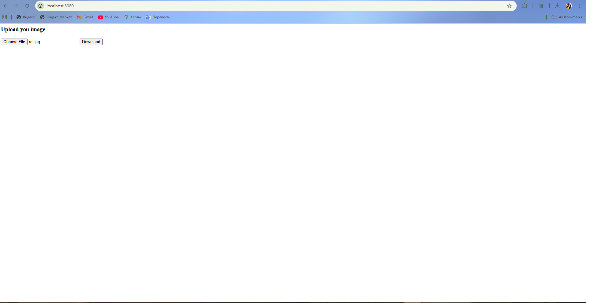

# cyber-terminal-art-converter
# Cyber Terminal Art Image Converter (Go & C++)

Image-to-terminal-art converter with a Go-based HTTP server and a powerful C++ processing core using OpenCV.
!Image not in terminal, saved in file!

## 🛠 Tech Stack
- **Backend:** Go (Golang)
- **Image Processing:** C++ with OpenCV
- **Communication:** The Go server executes the C++ binary to process uploaded images.

## 📁 Project Structure
- `/httpServer` - Go handlers for processing requests.
- `/processor` - C++ source code for Cyber Art conversion logic.
- `main.go` - Entry point of the application.

## 🚀 How to Run
1. **Prerequisites:**
   - Go installed
   - OpenCV 4.x installed and configured for your C++ compiler.
2. **Build the C++ processor:**
   Compile the `.cpp` file and place the executable in the `bin/` folder as `processor.exe`.
3. **Start the server:**
   ```bash
   go run main.go
   ```

## 🤝 Contributors
- [windwalker553](https://github.com)
- [1of-avangard](https://github.com)

## 📄 License
This project is licensed under the MIT License.

## 🖼 Result Example


| Original Image | Terminal Art Result |
| :---: | :---: |
|  |  |

*Main page of the application:*

